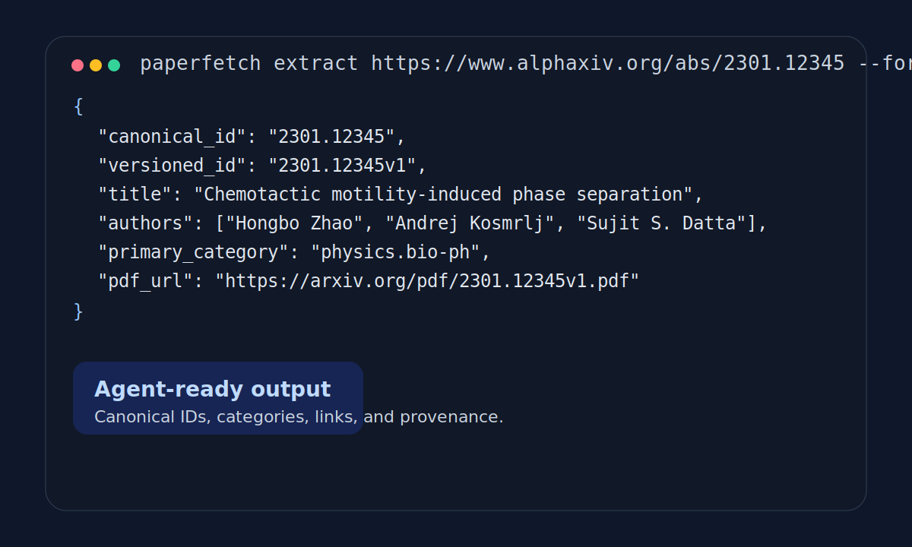
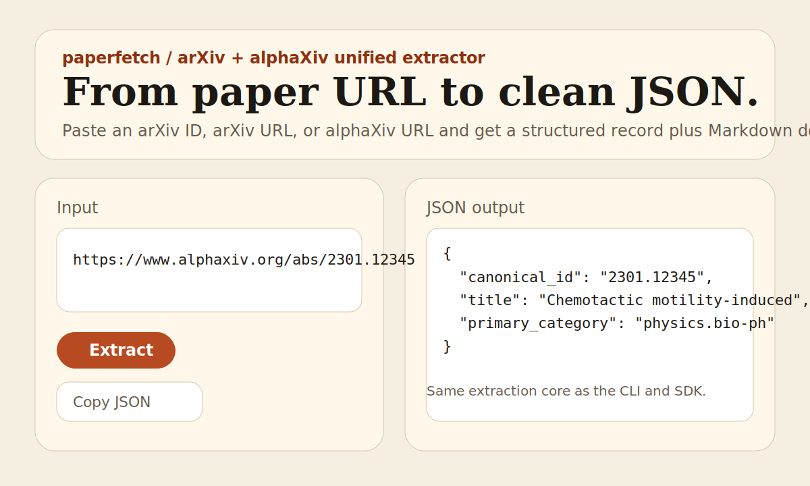

# `paperfetch`


Turn any `arXiv ID`, `arXiv URL`, or `alphaXiv URL` into clean structured JSON and Markdown for scripts, agents, and lightweight research pipelines.

```bash
paperfetch extract https://www.alphaxiv.org/abs/2301.12345 --format json --no-alpha
```

```json
{
  "canonical_id": "2301.12345",
  "versioned_id": "2301.12345v1",
  "title": "Chemotactic motility-induced phase separation",
  "authors": [
    "Hongbo Zhao",
    "Andrej Košmrlj",
    "Sujit S. Datta"
  ],
  "primary_category": "physics.bio-ph"
}
```




## Why This Exists

Most arXiv tooling gives you raw metadata feeds. Most scraping examples give you brittle page parsers. `paperfetch` sits in the middle:

- canonical metadata comes from `arXiv`
- optional enrichment comes from `alphaXiv`
- outputs are normalized for agents and developer workflows

This repository is intentionally opinionated about output quality, provenance, and graceful fallback behavior.

## Who It Is For

- AI agent builders who need clean JSON from paper identifiers and URLs
- developers building paper-aware tools, datasets, or internal workflows
- research engineers who want Markdown dossiers and structured metadata without a full ingestion stack

## Quickstart

Install from source:

```bash
pip install -e .
```

Install with demo and dev tooling:

```bash
pip install -e ".[dev,demo]"
```

Run the main commands:

```bash
paperfetch extract 2301.12345 --format json
paperfetch extract https://arxiv.org/abs/2301.12345 --format md
paperfetch batch examples/papers.txt --format ndjson
paperfetch serve --host 127.0.0.1 --port 8000
```

## CLI Examples

Extract canonical metadata only:

```bash
paperfetch extract 2301.12345 --format json --no-alpha
```

Extract a Markdown dossier:

```bash
paperfetch extract https://www.alphaxiv.org/abs/2301.12345 --format md
```

Write batch output to disk:

```bash
paperfetch batch examples/papers.txt --format ndjson --output outputs/papers.ndjson
```

Inspect the local demo:

```bash
paperfetch serve --host 127.0.0.1 --port 8000
```

## Python SDK

```python
from paperfetch import extract

record = extract("2301.12345", enrich_alpha=False)
print(record.canonical_id)
print(record.title)
print(record.to_json())
```

## Reliability Model

- `arXiv` wins canonical fields such as identifiers, dates, categories, and PDF links
- `alphaXiv` only enriches auxiliary fields such as views, likes, mentions, and discussion URLs
- undocumented alphaXiv runtime behavior is treated as experimental rather than authoritative
- every run records `provider_trace` and `warnings` so downstream systems can reason about provenance

## How It Differs

- Compared with `arxiv.py`: `paperfetch` focuses on end-to-end extraction outputs, not just feed access
- Compared with raw scraping snippets: `paperfetch` has a normalized schema, fallback behavior, and explicit provenance
- Compared with full PDF parsers: `paperfetch` intentionally stops at metadata and dossier generation

## Documentation

- [Docs index](docs/README.md)
- [Architecture](docs/architecture.md)
- [Schema and output contract](docs/schema.md)
- [FAQ](docs/faq.md)
- [Roadmap](docs/roadmap.md)
- [中文文档](docs/zh/README.md)

## FAQ

**Why is `alphaXiv` optional?**

Because `arXiv` is the canonical metadata source and `alphaXiv` is used as an enrichment layer that may be slower or less stable.

**Does this parse full PDFs?**

No. `paperfetch` extracts structured metadata and generates Markdown dossiers. It is not a PDF-to-Markdown parser.

**Why does the output include `provider_trace`?**

So agents and downstream systems can understand which source supplied which fields and whether any provider failed or was skipped.

## Development

```bash
python -m pytest
python -m ruff check .
python -m mypy src
python -m build --no-isolation
```

## Contributing

- Read [CONTRIBUTING.md](CONTRIBUTING.md) before opening a pull request
- Use the issue templates for bugs, feature requests, and provider breakages
- Check [CHANGELOG.md](CHANGELOG.md) and [SECURITY.md](SECURITY.md) for release and disclosure guidance
